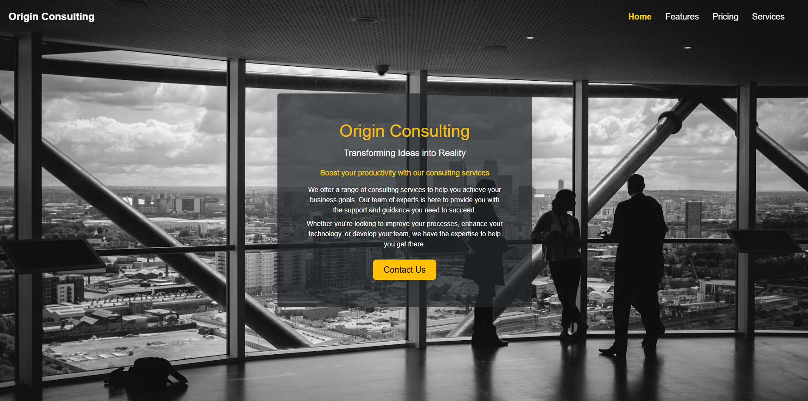

# Landing Page UI

A modern, professional landing page UI for a consulting business, built with HTML, CSS, and Bootstrap 5. The design features a glassmorphism hero section, a sticky blurred navbar, and a full background image for a premium look.

## Features
- Responsive design using Bootstrap 5
- Glassmorphism hero section with call-to-action
- Sticky, semi-transparent, blurred navbar
- Clean, professional typography and color scheme
- Easy to customize for your own business

## Preview




## Getting Started

1. **Clone the repository:**
   ```sh
   git clone https://github.com/yourusername/-landing-page-UI.git
   cd origin-consulting-landing
   ```
2. **Open `bt.html` in your browser.**

## File Structure
- `bt.html` – Main landing page
- `style.css` – Custom styles

- `image.png` – UI preview image (add your screenshot here)

## Customization
- Change the background image in `style.css` under the `body` selector.

- Edit text and links in `bt.html` as needed.

## License
This project is open source and available under the [MIT License](LICENSE).

---

**UI Preview:**


